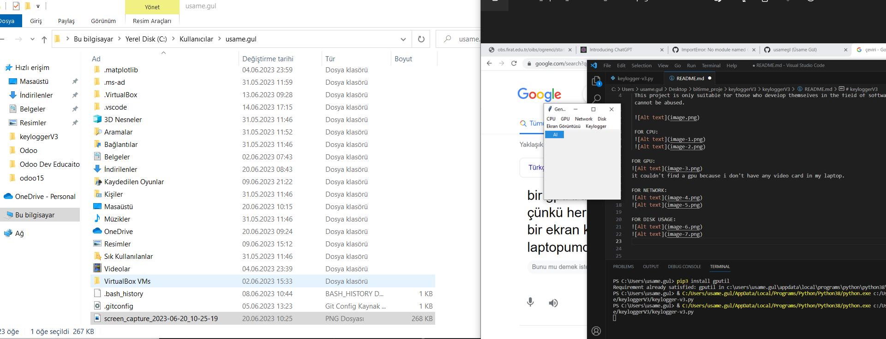

# keyloggerV3
 Developed with Python, includes many options and optimized. 
 
 This project is only suitable for those who develop themselves in the field of software and security. It cannot be abused.

 FOR GENERAL MENU: 

 

 FOR CPU:

 
 

FOR GPU: 

it couldn't find a gpu because i don't have any video card in my laptop.

FOR NETWORK:

FOR DISK USAGE:

FOR SCREENSHOTS:

FOR KEYLOGGER: 

When we say start, it starts recording keystrokes.
 
When we say stop, it stops the running keylogger. 

When we say show logs, it shows the logs of whatever button is touched or clicked.

